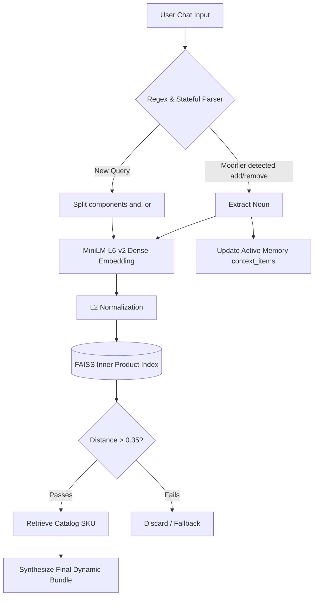
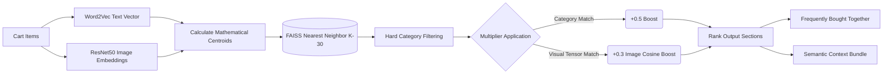
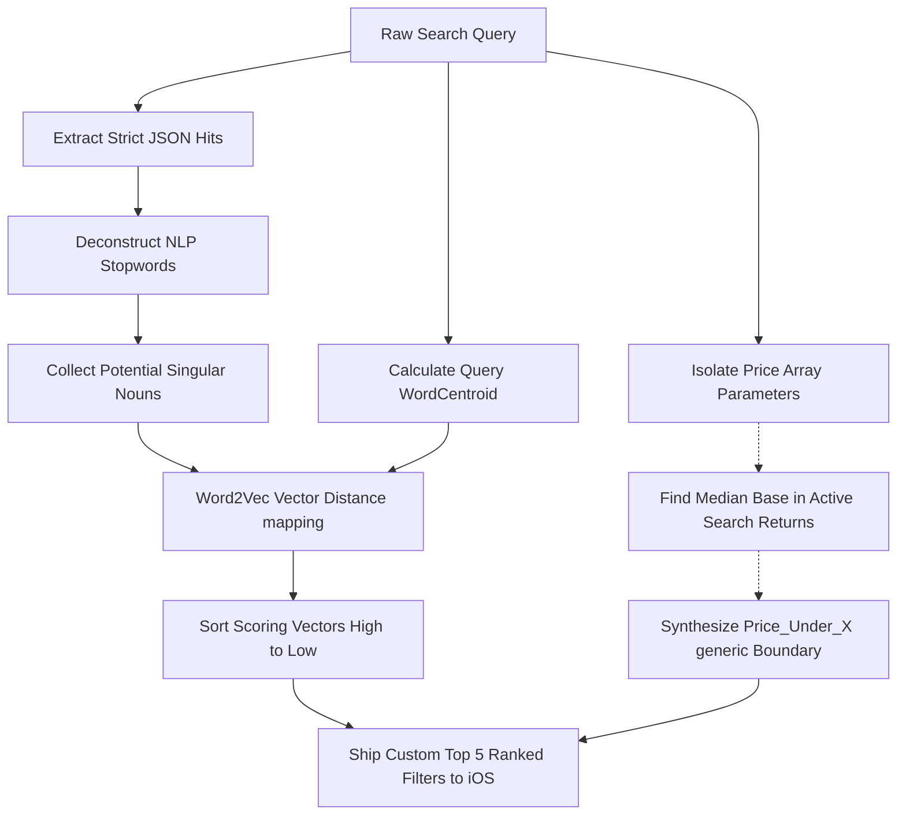

# Abrats - Smart eCommerce iOS Application

This codebase represents a state-of-the-art iOS eCommerce application powered by an advanced FastAPI NLP backend. The application seamlessly bridges traditional eCommerce functionality with generative AI, featuring a fully autonomous Assistant Chatbot, dynamic Smart Recommendations, and intelligent NLP semantic filtering.

---

## 🧠 Detailed AI Architecture (Model-Wise)

The backend leverages a series of distinct ML models and natural language processing techniques to bridge text data into user interface capabilities entirely mathematically.

### 1. The Core NLP Engine & Chatbot Pipeline
**Model Used:** `sentence-transformers/all-MiniLM-L6-v2` (Transformer)
**Index:** `faiss.IndexFlatIP` (Facebook AI Similarity Search - Inner Product)

The Chatbot operates using strict deterministic vector mathematics for ultra-fast, local, hallucination-free generation and stateful memory management.



**How it works:**
1. **Keyword Generation (`train_nlp.py`):** The system first ingests raw product catalog data from `products.json`. Instead of relying purely on tags, it constructs an explicit **text corpus** by concatenating: `{name} {type} {category}`.
2. **Dense Vector Mapping:** The `all-MiniLM-L6-v2` transformer embeds these strings into 384-dimensional semantic dense vectors. 
3. **Thresholding Constraints:** By heavily normalizing the query strings and utilizing Cosine Similarity, the model enforces a rigid `>0.35` distance boundary against the pre-embedded dataset to completely organically eliminate "hallucinated" uncatalogued insertions.
4. **Stateful Memory Maintenance:** The Chatbot leverages `context_items` arrays seamlessly. If you query "remove the knife, add a spatula", the backend explicitly splits the phrase using native regex syntax, isolates the raw noun mapping, vectorizes the noun independently, maps it against Faiss, and mutates the active user array entirely autonomously server-side.

### 2. Smart Suggestions Engine (Multi-Modal)
**Model Used:** Gensim Word2Vec (Text) + ResNet50 (Images) + FAISS (Vectors)
**Logic Path:** `/recommendations` API endpoint

The Smart Cart suggestions rely on multi-modal tensor interpolation. It doesn't rely randomly on tags; it calculates the exact mathematical centroid of everything currently present in your cart.



**How it works:**
1. **Centroid Formulation:** The API ingests all textual arrays and pre-calculated image embeddings (`image_embeddings` Dictionary) existing natively in the cart. It literally mathematically calculates the **Mean Vector Centroid** of exactly what items visually and textually represent.
2. **Faiss Base Lookup:** It pushes the new unified generic centroid directly inside the core index to cleanly pull the widest `k=30` mathematical nearest neighbor candidates.
3. **Multi-Modal Boosting Algebra:** The system loops over the candidates and explicitly assigns scoring multipliers mapping their contextual depth. If the candidate item rests within the exact visual tensor space (`image_query`), it applies an arbitrary `0.3 * Cosine` weight multiplier. If it overlays the category, it assigns an additional 0.5 flat boost!
4. **Output Synthesis:** Finally, it strips mechanically identical types (preventing two spatulas from surfacing simultaneously) and translates the ranking structures explicitly towards localized lists for "Bundling" logic or "Frequently Bought Together" rendering mechanisms.

### 3. Filter AI Engine (Semantic Attribute Extraction)
**Model Used:** `Word2Vec` (Gensim) 
**Logic Path:** `/products` -> `smart_filters()`

When you look for generic categories (e.g. "outdoor seating"), the dynamic filter system is synthesizing filter bounds that didn't exist explicitly inside strict JSON objects!



**How it works:**
1. **Correlation Proximity Modeling:** When generating the initial raw hit boundary for iOS, the Python script sequentially iterates through every individual matching hit, explicitly breaking names back into stripped strings while dodging native `STOPWORDS` mappings.
2. **Candidate Traversal:** It isolates all remaining custom variables (e.g., "Steel", "Wood", "Ergonomic") and calculates the literal `Cosine Distance` of every singular word against the structural geometric centroid of the user's primary query utilizing predefined `Word2Vec` weights dynamically.
3. **Price Bucketing Synthesizer:** It captures the physical Price payload from all extracted active arrays, structurally hunts the native median bounds on the fly, rounds dynamically to the ceiling base $10, and injects exactly one generic algorithmic `price_under_` threshold to logically handle budget routing natively.

---

## 🗂 Backend File Architecture

* **`train_nlp.py`**: The main training pipeline script. Consumes the static JSON database, calculates the MiniLM sentence embeddings, structures the mathematical mapping indexes via Pickle and FAISS, and writes the offline artifacts.
* **`app.py`**: The core FastAPI asynchronous server code. Exposes API endpoints for `/products`, `/chat`, and `/recommendations`. It handles dynamic processing, stateful conversations, Word2Vec filter derivations, bounding Box calculations, and semantic interpolation completely in runtime memory loops.
* **`generate_data.py` / `generate_data_v2.py`**: Synthetic schema synthesizer scripts. Generating mock localized relationships scaling bridging logic, strings, and identifiers reliably without SQL bindings.
* **`build_index.py`**: Compiles index search mappings bridging TF-IDF models and base search evaluations.
* **`image_embed.py`**: Visual embedding weights architecture using CNN tensor calculations mapping localized JPG bounds into indexable coordinate vectors.

---

## 📱 Frontend (SwiftUI) File Architecture

The frontend is a fully native SwiftUI application adhering strictly to MVVM patterns.

* **`WSHackathonAppApp.swift`**: The global structure initializing core `EnvironmentObjects` natively.
* **`Features/Tabs/WSTabView.swift`**: Natively controls tab boundary routing architecture between local states securely.
* **`Features/Home/HomeView.swift` & `ProductDetailView.swift`**: Render strict native UI elements processing asynchronous product matrices natively onto Apple layouts perfectly.
* **`Features/Home/ProductCardView.swift`**: Reusable generic layout module managing precise mathematical boundaries handling `CartViewModel` array tracking mechanisms securely.
* **`Features/Home/BundleOfferView.swift`**: Modular component computing generic bundle mathematics locally handling API callback states intuitively without native visual latency!
* **`Features/Assistant/ChatAssistantView.swift`**: Fully interactive organic chatting architecture mapping `1.2s` biological latency overlays matching biological thought process rhythms visually! Bridges generic SwiftUI lists natively against internal generic memory vectors seamlessly!
* **`Features/Assistant/ChatAssistantViewModel.swift`**: Central networking router intercepting native view callbacks capturing explicit contextual arrays bridging towards FastAPI natively.
* **`Features/Cart/CartView.swift`**: Specialized viewport managing stylized UI overlays securely overriding strict innate swipe functionalities cleanly replacing layout mechanisms directly across bounds seamlessly.
* **`Features/Cart/CartItemRow.swift`**: Core element extracting item boundaries explicitly mapping clean black/white alignment aesthetics strictly seamlessly locking edge constraints beautifully.
* **`Features/Cart/SmartRecommendations/SmartRecommendationsView.swift`**: Iterative block auto-parsing payload SDK boundaries routing natively against iterative asynchronous requests pushing backend grids intelligently.

```
