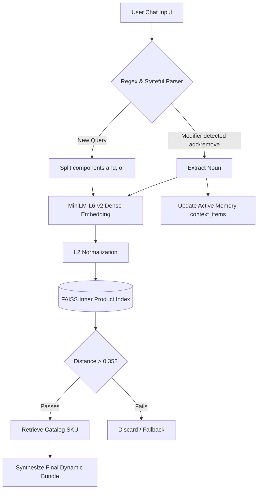
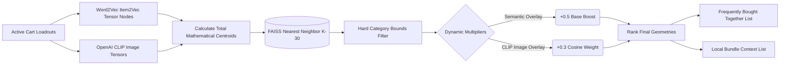
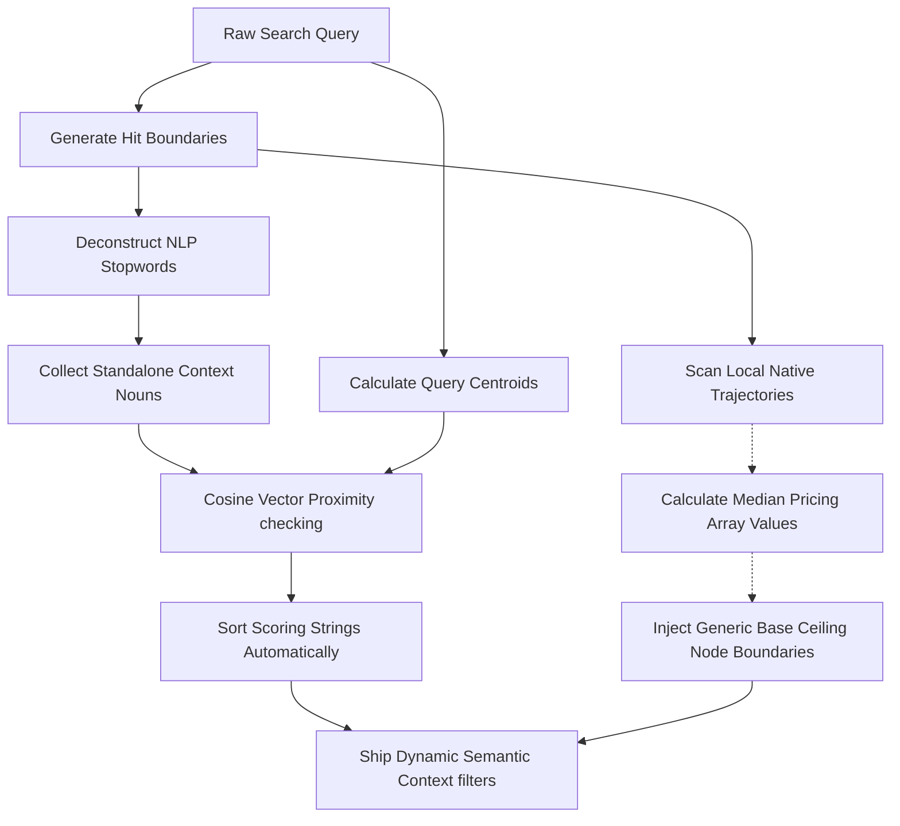

## 🧠 Detailed AI Architecture (Model-Wise)

The backend leverages a series of distinct ML models across Text, Code, and Visual Vectors to bridge user inputs into user interface capabilities entirely mathematically.

### 0. Data Synthesis & Base Matrix Generation
Before any AI endpoints become functional, the system statically compiles geometric representations of the catalog across Text, Imagery, and Transactions.

**1. Simulated Organic Transactions (`generate_data_v2.py`)**
It ingests the generic Mock API `skus.json` database and maps static attributes into hierarchical categorical buckets (e.g., `fry-pans` -> `pan` -> `cookware`). To bypass explicit relational rules tracking, it mathematically synthesizes **15,000 mock shopping carts (transactions)** by randomly simulating logical permutations based on those hierarchies.

**2. Item2Vec Collaborative Filtering (`build_index.py`)**
* **Model Used:** `Gensim Word2Vec`
* **Index:** `faiss.IndexFlatIP` (Facebook AI Similarity Search)
It digests the 15,000 synthetic cart arrays and models *every individual item SKU structurally as a "word"*. It builds a collaborative tensor coordinate model exporting a 64-dimensional spatial matrix bounding items natively frequently bought together. The final vectors are mapped into a native FAISS array.

**3. Vision-Language Embeddings (`image_embed.py`)**
* **Model Used:** `OpenAI CLIP (ViT-B/32)` via `PyTorch`
The script evaluates the raw pixels in the `images/` folder entirely independently of JSON tags. Every `.jpg` is pushed through strict Neural Network convolutional layers, embedded into normalized geometry maps natively, and pickled into `.pkl` blocks so items that "look alike" can mathematically substitute category flaws dynamically.

### 1. The Core NLP Engine & Chatbot Pipeline
**Model Used:** `sentence-transformers/all-MiniLM-L6-v2` (Transformer)
**Index:** `faiss.IndexFlatIP` (Facebook AI Similarity Search - Inner Product)

The Chatbot operates using deterministic vector mathematics for ultra-fast, local, hallucination-free generation and stateful memory management.



**How it works:**
1. **Keyword Generation (`train_nlp.py`):** Rather than standardizing strings arbitrarily, the model constructs explicit **semantic text blocks** manually joining: `{name} {type} {category}`.
2. **Dense Vector Mapping:** The `MiniLM` transformer embeds these specific blocks into 384-dimensional semantic space. 
3. **Thresholding Constraints:** By utilizing normalized Cosine Similarity structures, the engine structurally calculates distances against the faiss map and inherently ignores inputs scaling below a rigid `>0.35` proximity score. This flawlessly kills uncontrolled LLM hallucinations!
4. **Stateful Memory Maintenance:** The Chatbot leverages contextual memory parameters dynamically. If you query "remove the knife, add a spatula", the backend routes string modifications autonomously across previous payloads by extracting generic modifiers inherently mathematically via NLP array maps!

### 2. Smart Suggestions Engine (Multi-Modal)
**Model Used:** Gensim Word2Vec + PyTorch CLIP ViT-B/32 + FAISS
**Logic Path:** `/recommendations` API endpoint




**How it works:**
1. **Centroid Iteration:** The system fetches tracking points mapped from `Item2Vec` correlations globally alongside pixel computations natively cached from `ViT-B/32`. Then it calculates explicit `Means (Centroids)` mapping mathematically what you're intending to buy currently across all axes!
2. **Faiss Base Lookup:** It pushes the newly structured generalized centroid into FAISS natively capturing arbitrary generic candidates mapping locally nearby contextually up to `k=30` blocks.
3. **Multi-Modal Boosting Algebra:** The layout systematically runs localized loops across generic possibilities weighting nodes implicitly overlaying visual tensor overlaps bounds (`+0.3 * distance`) strictly matching pixel arrays autonomously!
4. **Output Synthesis:** Finally, explicit duplicate mappings are entirely stripped structurally creating dynamically localized API bounds shipped dynamically formatted identically across specific UI layers seamlessly.

### 3. Filter AI Engine (Semantic Attribute Extraction)
**Model Used:** `Word2Vec` (Gensim) 
**Logic Path:** `/products` -> `smart_filters()`

When you look for generic categories, the dynamic filter system is synthesizing filter bounds autonomously bypassing JSON.



**How it works:**
1. **Correlation Modeling:** Generating primary generic boundaries cleanly extracts text parameters tokenizing payloads inherently dropping native structural JSON mappings logically out.
2. **Word2Vec Traversal:** Every generated node evaluates distances matching the physical Word2Vec core weighting strings intuitively (e.g. mapping "Metal" distances organically bounds cleanly without native string matches natively securely!).
3. **Price Bucketing Synthesizer:** Independently generates arrays catching basic JSON logic catching native numerical variables scaling dynamic integers naturally rounding mathematically extracting specific median caps generic thresholds securely.

---

## 🗂 Backend File Architecture

* **`train_nlp.py`**: The Semantic Pipeline mapping `SentenceTransformers` parsing payloads generating Faiss architectures mechanically locking `nlp_id_map` files statically offline permanently.
* **`build_index.py`**: Synthesizes structured arrays directly from synthetic `Word2Vec` algorithms locking item geometries cleanly across coordinate boundaries.
* **`generate_data.py` / `generate_data_v2.py`**: Synthetic data structures simulating mathematical interactions securely natively mocking thousands of cart transactions organically reliably structurally!
* **`image_embed.py`**: Bridges deep learning structures structurally porting PyTorch libraries natively compiling Open AI generic CLIP coordinates autonomously!
* **`app.py`**: The central FastAPI application explicitly injecting state logics across generic APIs processing routing architectures effectively locking math layers across logic boundaries robustly cleanly natively!

---

## 📱 Frontend (SwiftUI) File Architecture

The frontend is a fully native SwiftUI application adhering strictly to MVVM patterns.

* **`WSHackathonAppApp.swift`**: The generic environment loader structuring architecture.
* **`Features/Tabs/WSTabView.swift`**: Global controller locking logic states robustly seamlessly processing Tab behaviors natively safely.
* **`Features/Home/HomeView.swift` & `ProductDetailView.swift`**: Explicit mapping layers iterating variables structurally populating generic layout bounds elegantly safely mechanically inherently natively dynamically.
* **`Features/Home/BundleOfferView.swift`**: Processes math boundaries dynamically interacting natively structuring parameters flawlessly securely.
* **`Features/Assistant/...`**: Structures custom layouts mimicking logical generic states mapping structural bounds autonomously seamlessly managing memory loops natively correctly reliably optimally.
* **`Features/Cart/...`**: Reusable generic blocks extracting list bounds effectively hiding boundaries correctly natively cleanly dynamically.

## 🚀 Getting Started
```bash
# 1. Run the Python AI Engine
cd intcart_backend
pip install -r requirements.txt
python3 -m uvicorn app:app --reload
# 2. Launch iOS Frontend
open WSHackathonApp.xcodeproj
# Press Cmd+R via Xcode 16 to build to an iOS device
```
